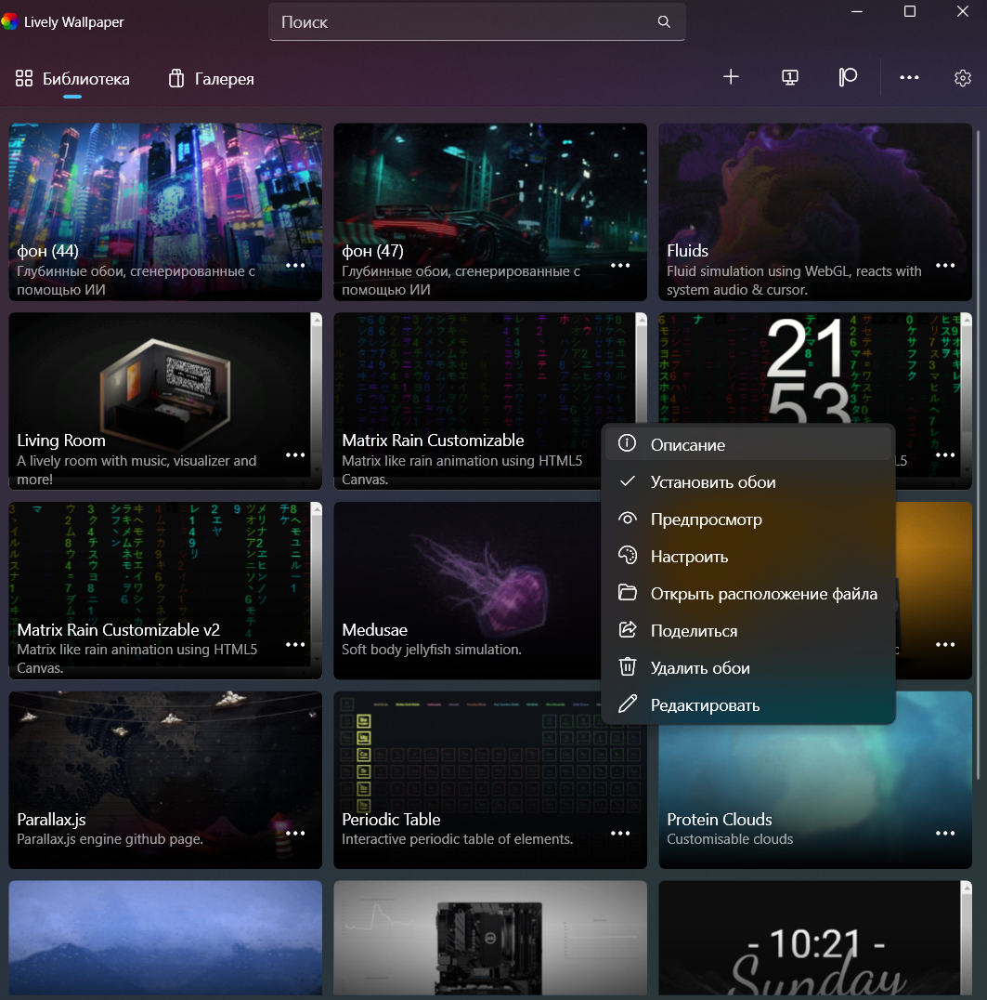
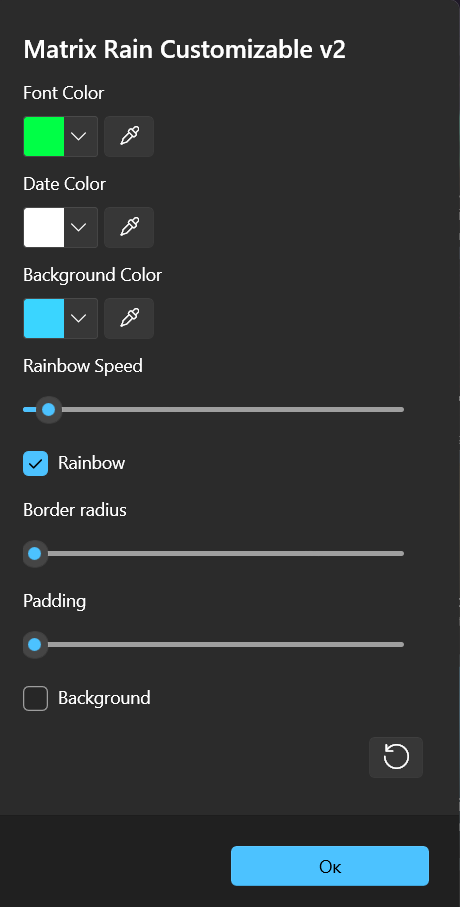
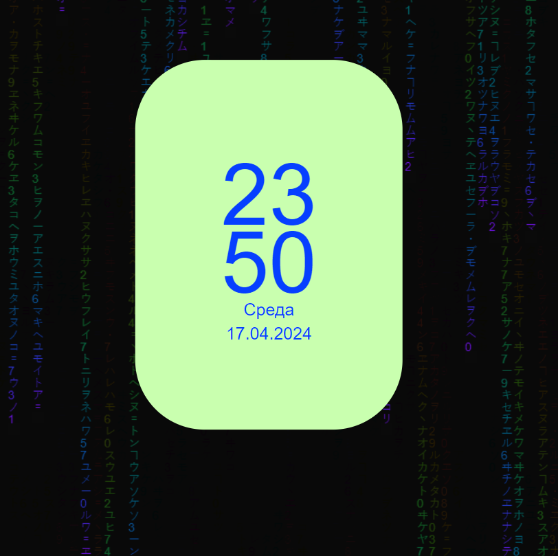
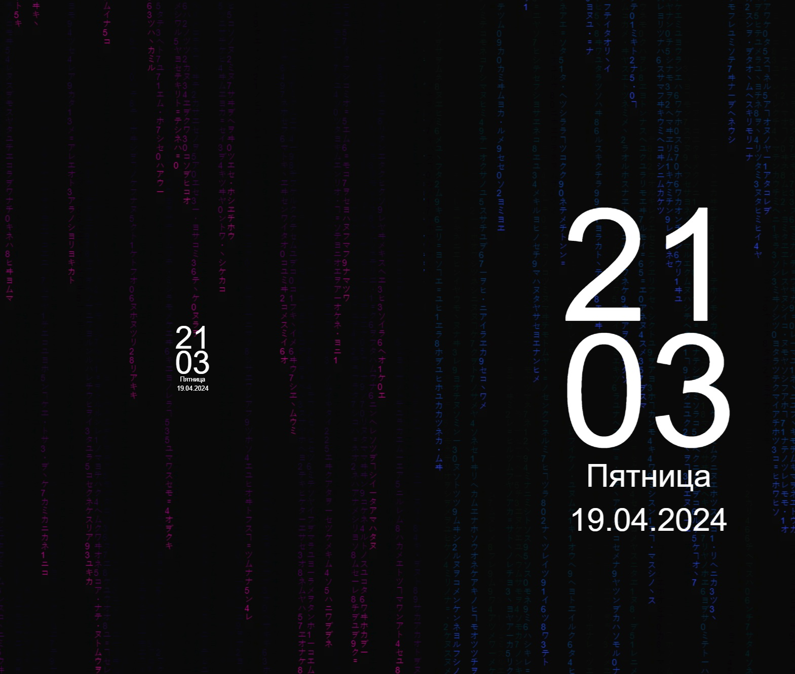

# matrix

Matrix like animation using HTML5 Canvas. Inspired from [sample code](http://thecodeplayer.com/walkthrough/matrix-rain-animation-html5-canvas-javascript) on [thecodeplayer.com](http://thecodeplayer.com/).

See it in action @ http://parambirs.github.io/matrix

@ 2020-09-05 - added lively customizable options (rainbow / color select) - khuong

@ 2024-04-17 - adding a clock and adapting to it - Nickan

# Для установки обоев скачать проект с гит и закинуть в папку

# AppData\Local\Packages\12030rocksdanister.LivelyWallpaper_97hta09mmv6hy\LocalCache\Local\Lively Wallpaper\Library\wallpapers

Так же в папку можно попасть через прогу.

нажать на открыть расположения файла и в папку wallpapers загрузить проект перезапустить програму и можно наслаждаться

# Улучшенные настройки.

# Добавлена функция изменения размера

# Добавлена функция отключения часов и горизонтальные, вертикальные часы 

