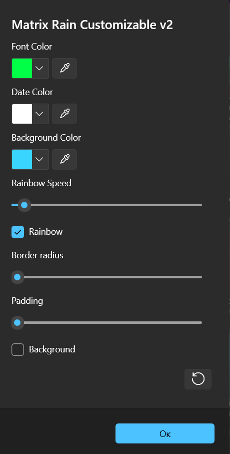
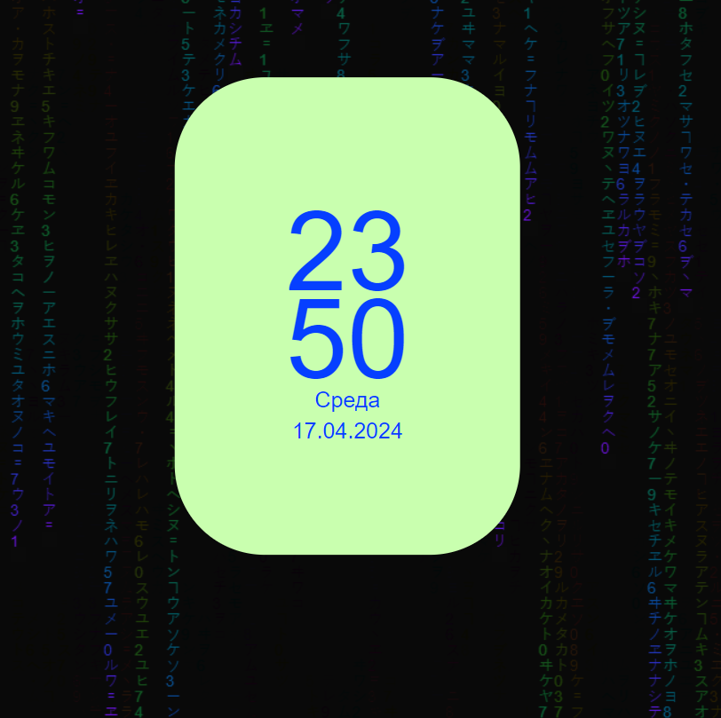
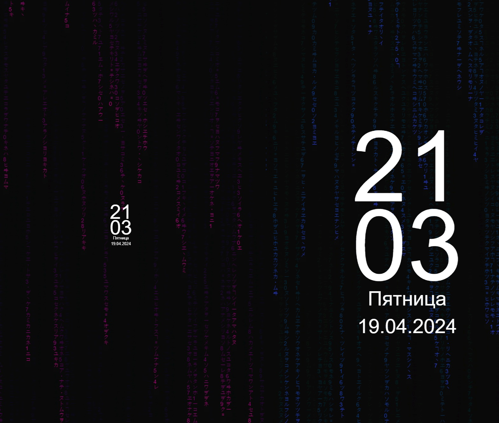
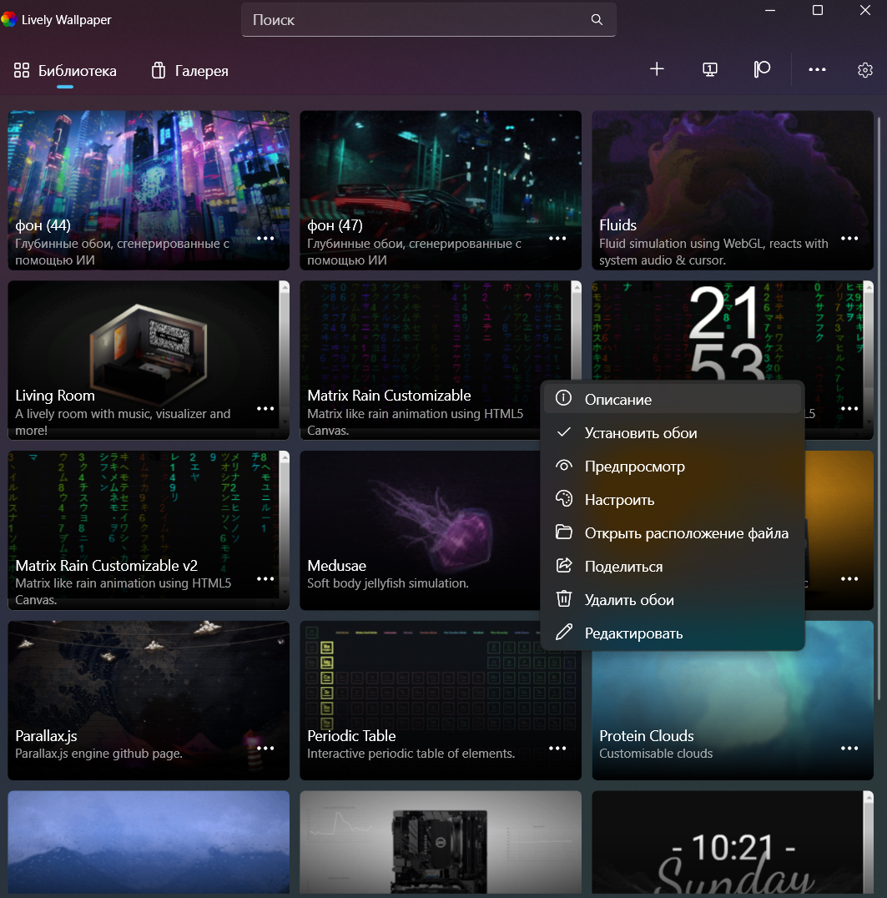

# Matrix Rain + Часы 🕐

[](README_EN.md)

Анимация «Матричного дождя» с часами и датой — живые обои для [Lively Wallpaper](https://www.rocksdanister.com/lively/).


## 📜 История проекта

| Дата | Автор | Изменения |
|------|-------|-----------|
| — | [parambirs](https://github.com/parambirs/matrix) | Оригинальная анимация Matrix Rain на HTML5 Canvas |
| 2020-09-05 | khuong | Добавлены настройки Lively (радуга / выбор цвета) |
| 2024-04-17 | [Nickan](https://github.com/nickan) | Добавлены часы, дата, масштабирование и другие настройки |

> **Примечание:** это форк. Я (Nickan) добавил часы, дату и расширенные настройки. Оригинальный проект: [parambirs/matrix](https://github.com/parambirs/matrix).

## ✨ Возможности

- 🌧️ **Матричный дождь** — классическая анимация с японскими символами (катакана)
- 🕐 **Часы и дата** — текущее время, день недели, дата поверх анимации
- 🌈 **Радужный режим** — переливающиеся цвета символов с настраиваемой скоростью
- 🎨 **Настройка цветов** — отдельно для символов, часов и фона
- 📐 **Масштабирование** — изменение размера часов
- 🔄 **Горизонтальное / вертикальное** отображение часов
- 🖥️ **Поддержка двух мониторов** (при разрешении ≥ 2560px)
- ⚙️ **Полная интеграция с Lively Wallpaper** — все настройки доступны из интерфейса программы

## 🖼️ Скриншоты настроек








## 📦 Установка

1. Установите [Lively Wallpaper](https://www.rocksdanister.com/lively/) (бесплатно, Microsoft Store / GitHub)
2. Скачайте или клонируйте этот репозиторий:
   ```
   git clone https://github.com/nickan/Matrix-and-clock.git
   ```
3. Скопируйте папку проекта в каталог обоев Lively:
   ```
   AppData\Local\Packages\12030rocksdanister.LivelyWallpaper_97hta09mmv6hy\LocalCache\Local\Lively Wallpaper\Library\wallpapers
   ```
   Или откройте эту папку через интерфейс Lively:

   

4. Перезапустите Lively Wallpaper — обои появятся в библиотеке.

## ⚠️ Двойной монитор

Функция для двух мониторов работает через CSS media query `(min-width: 2560px)`. Если ваше суммарное разрешение превышает 4K, могут отображаться лишние часы. Рекомендуется:

- Выставить режим «Копировать» в настройках Lively
- Лучше всего работает с двумя мониторами 2560×1440 (2K)

Если возникнут баги — пишите в [тему на lolz.live](https://lolz.live/threads/8985803/).

## 🛠️ Технологии

- HTML5 Canvas
- Vanilla JavaScript
- CSS3

## 📄 Лицензия

Оригинальный проект создан [parambirs](https://github.com/parambirs/matrix), вдохновлённый [thecodeplayer.com](http://thecodeplayer.com/walkthrough/matrix-rain-animation-html5-canvas-javascript).
